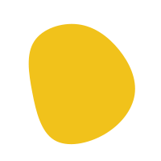
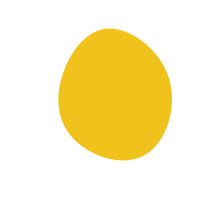

<!-- ////////////////////////// calendar /////////////////////////////////// -->

🌟 August 4th–6th • 11:00AM—12:30PM Daily • Ages 8–12 • 100% FREE

- 🎮 **Learn to code** through games, stories, and creativity
- 🖥️ **No previous experience** required (or downloads!)
- 🧠 **Build real Python coding skills** while having fun!

[👉 BOOK NOW – Spots Are limited!](#tally-open=me2D5o&tally-emoji-text=👋&tally-emoji-animation=wave){.gl-button data-tally-open="me2D5o"}

<!-- SUGGESTIONS: 📸 *Suggested Image: A vibrant hero character in the Ozaria game world, laptop open, kids looking amazed and engaged in the background. -->

<!-- /.su-body -->

<!-- /.signup -->

<!-- ////////////////////////// breakout /////////////////////////////////// -->
<!-- ///////////// images first, second large screen //////////////////////// -->

{.b-left}

  1
  

## 😩 Want to beat the summer boredom?

If you’re like most parents, summer brings some familiar challenges ...

<!-- /.b-left -->

<!-- /.breakout -->

- **Your child is glued to YouTube** or games that teach them nothing.
- **They’re bored. You're busy.** And you’re running out of ideas.
- **You're worried they’ll lose academic skills** (“summer slide”) before school even starts.

The worst part? That wasted screen time could have been spent doing something that’s actually *fun* and *valuable* for their future.

You’ve tried activity books… coding apps that felt too much like homework… even begging them to do something "productive."

But nothing sticks.

Here’s the truth: Kids don’t hate learning. They just need the *right* kind of learning—something that feels like a game and keeps their curiosity alive.

<!-- /.bc-four -->

<!-- //////////////////// normal w/ float image ///////////////////////////// -->

{.left}

## 👋 Hey, I’m Rob, and I help kids fall in love with Coding

> Over the past 5 years, I’ve taught coding to over 800 learners — from 8 to 60 years old.

I believe learning to code should be **fun, creative, and confidence-building.** Not intimidating or boring.

That’s why I'm running **Code for Kids - Ozaria Summer Coding Adventure**. It’s built around **Ozaria**, a story-rich coding platform used in classrooms worldwide.

With Ozaria, kids don’t just learn to code—they become the heroes of their own game.

**Why kids love Ozaria**

- Trusted by educators worldwide
- 90% of students feel confident coding after Ozaria
- 99% say they *enjoy* learning with it

And now, your child can try it for free—this summer.

<!-- /.bc-four -->

<!-- ////////////////////////// breakout /////////////////////////////////// -->
<!-- ///////////// images first, second large screen //////////////////////// -->

{.b-right}

  2
  

## What Is Ozaria?

> 🧙‍♂️ This summer we'll get together for a **100% free, three-day online coding adventure** where your child will:

<!-- /.b-right -->

<!-- /.breakout -->

<!-- ///////////////////// breakout — additional /////////////////////////// -->

🗓 **Dates:** August 4th–6th | 🕒 **Time:** 11:00AM—12:30PM | 💻 **Location:** Online

- Dive into an epic fantasy world
- Solve puzzles and write real Python code
- Build their own mini-games and interactive stories
- Team up with others and think like a tech creator

All you need is a computer or laptop and yourself!

<!-- ////////////////////////// breakout /////////////////////////////////// -->
<!-- ///////////// images first, second large screen //////////////////////// -->
<!-- 🎮 *GAMEPLAY: Split-screen—one side shows Ozaria’s fantasy game world;  -->

{.b-left}

  3
  

## 🎯 What they’ll learn (and why it matters)

- ✅ Real Python Coding
- ✅ How to solve problems themselves
- ✅ Story-Based Challenges
- ✅ Teamwork & Collaboration
- ✅ Simple & Accessible

<!-- /.b-left -->

<!-- /.breakout -->

<!-- //////////////////////////// normal /////////////////////////////////// -->

## 🐍 Real Python coding

> They’ll learn the foundations of one of the most-used coding languages in the world.

* **Why it matters:** Python is used by developers at Google, Netflix, and NASA. It’s also the most beginner-friendly.

### Help kids to solve problems themselves

> **Why it matters:** Creative coding keeps them engaged and gives them a sense of ownership.

Kids don’t just follow lessons — they learn how to problem solve and look up solutions by themself

### Story-based challenges

> **Why it matters:** Storytelling sparks imagination and makes abstract concepts easier to grasp.

They'll become the main character in a coding quest that unfolds as they learn.

### Teamwork & collaboration

> **Why it matters:** Builds communication, problem-solving, and peer confidence.

Even online, they’ll solve challenges together.

### Simple & accessible

> **Why it matters:** Works from any home computer with internet—perfect for busy parents.

Easy to setup, easy to start. Just log in and go.

<!-- /.bc-four -->

<!-- ////////////////////////// calendar /////////////////////////////////// -->

🌟 Here’s what you’re signing up for

- ✅ A boredom-busting summer experience
- ✅ Real skills that can last a lifetime
- ✅ A confidence boost in logic, problem-solving, and creativity
- ✅ A safe and supportive online space
- ✅ And… an exciting introduction to the tech world of tomorrow

This isn’t just another Zoom activity.
It’s an adventure that could shape your child’s future.

 

[👉 BOOK NOW – Spots Are limited!](#tally-open=me2D5o&tally-emoji-text=👋&tally-emoji-animation=wave){.gl-button}

<!-- /.su-body -->

<!-- /.signup -->

---

<!-- //////////////////////////// normal /////////////////////////////////// -->

## 🤔 “But what if my child has never coded before?”

> Perfect. This adventure is made **specifically for beginners.**

- They don’t need to be “techy”
- They don’t need experience
- They don’t need to be top of their class

They just need curiosity and a computer.

By the end of Day 3, they’ll have written real Python code, collaborated with others, and ready to take on harder challenges.

**Confidence = unlocked.**

## 🎁 Bonuses that make this a no-brainer

{.right}

As part of the free Ozaria Summer Coding Adventure, your child also gets:

### 🎓 Coding Hero certificate

A printable award to celebrate their progress. Proud-parent moment, guaranteed!

### 🧠 Coding flashcards

Simple, visual flashcards to help lock in what they’ve learned—perfect for practice after the event.

<!-- 🧾 *Suggested Image: A fun-looking “Coding Hero” certificate next to colorful flashcards on a desk.* -->

<!-- /.bc-four -->

<!-- ///////////////////////// testimonials //////////////////////////////// -->

## 💬 Here’s what others are saying

> "Introduces students to computer science concepts without the heavy theory. Keeps them engaged with fun graphics and game concepts without overwhelming them."
> — Adam K.

> "I never thought I would be coding the way I am today but if I can do it, anyone can."
> — Kaila

### ✅ 90%

Of students say they feel confident coding after Ozaria

### ✅ 99%

Say they *enjoy* using it to learn

<!-- /.t-split -->

<!-- /.testimonials -->

<!-- ////////////////////////// calendar /////////////////////////////////// -->
<!-- 📸 *Suggested Image: A countdown timer, bold text: “Only X Days Left to Join!”* -->

🌟 Time to book your spot!  ⰠLimited spots available — **registration closes August 3rd!**

> Give your child the tools to create, think logically, and have a blast—all while learning to code.

- 💰 **Price:** Free!
- 🎁 **Real value:** £112+ (if this were a paid camp)
- 📅 **Dates:** August 4th–6th
- 🕒 **Time:** 11:00AM—12:30PM
- 💻 **Location:** Online

[👉 BOOK NOW – Spots Are limited!](#tally-open=me2D5o&tally-emoji-text=👋&tally-emoji-animation=wave){.gl-button}

<!-- /.su-body -->

<!-- /.signup -->

<!-- //////////////////////////// normal /////////////////////////////////// -->

## ❓ Frequently asked questions

**What age group is this course suitable for?**
Kids aged 8–12. It’s beginner-friendly and designed to be fun!

**What does my child need to join?**
Just a computer with internet and a curiosity for adventure. That’s it—no downloads or fancy tech required.

**Is this really free?**
Yes! 100% free. No hidden costs, no upsells. Just fun, interactive learning.

**What if my child has never coded before?**
Even better. This is the perfect way to start. We take them step-by-step through every challenge.

**How long are the sessions?**
1.5 hours each day — 11:00 AM to 12:30 PM—for three days. We'll have a couple of breaks so the students don't get tired.

<!-- /.bc-four -->

<!-- //////////////////////////// normal /////////////////////////////////// -->

## 🧠 Before you go ...

You can keep looking for summer activities that might engage your child…
Or you can give them something that’s:

* ✅ Fun
* ✅ Educational
* ✅ Creative
* ✅ Completely free

They’ll walk away with new skills, more confidence, and a big smile on their face.

Let the adventure begin!

[👉 BOOK NOW – Before August 3rd!](#tally-open=me2D5o&tally-emoji-text=👋&tally-emoji-animation=wave){.gl-button}

<!-- /.gl-bc-four -->

